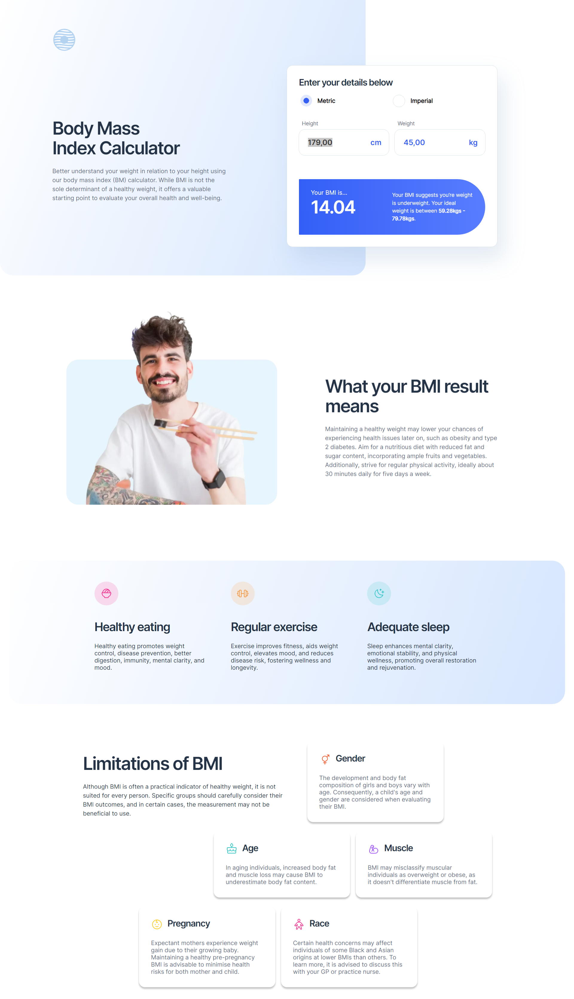

# Frontend Mentor - Body Mass Index Calculator solution

This is a solution to the [Body Mass Index Calculator challenge on Frontend Mentor](https://www.frontendmentor.io/challenges/body-mass-index-calculator-brrBkfSz1T). Frontend Mentor challenges help you improve your coding skills by building realistic projects.

## Table of contents

- [Overview](#overview)
  - [The challenge](#the-challenge)
  - [Screenshot](#screenshot)
  - [Links](#links)
- [My process](#my-process)
  - [Built with](#built-with)
  - [What I learned](#what-i-learned)
  - [Useful resources](#useful-resources)
- [Author](#author)

**Note: Delete this note and update the table of contents based on what sections you keep.**

## Overview

### The challenge

Users should be able to:

- Select whether they want to use metric or imperial units
- Enter their height and weight
- See their BMI result, with their weight classification and healthy weight range
- View the optimal layout for the interface depending on their device's screen size
- See hover and focus states for all interactive elements on the page

### Screenshot

### Links

- Solution URL: [Github](https://github.com/travisdk/bmi-calculator/tree/main/bmi-calculator)
- Live Site URL: [Add live site URL here](https://your-live-site-url.com)

## My process

### Built with

- Semantic HTML5 markup
- Flexbox
- Mobile-first workflow

### What I learned

Limitations with my solution:
There is no limit on how large values can be entered in the inches and lbs fields.
If they exceed their maximum, the feet and stones fields are increased accordingly.
Negative values are allowed - which should not be the case in real life application.

### Useful resources

https://www.thecalculatorsite.com/conversions/common/kg-to-stones-pounds.php

## Author

- Website - [Henrik Juhl](https://www.hekkecoding.com)
- Frontend Mentor - [@travisdk](https://www.frontendmentor.io/profile/travisdk)
